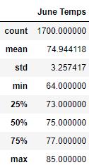
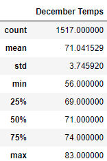

# surfs_up
## Overview of Analysis
We're looking into the temperature data in Hawaii to help our potential investor decide if a surf and ice cream shop business will be sustainable year-round. We'll be looking at and comparing the months of June and December for this.

## Results
### Data
 
### Comparisons
- June has a slightly higher mean temperature at 74.94 while December is at 71.04.
- Decemeber has a much lower low than June at 56 while June's only goes down to 64.
- The highs are fairly close with June at 85 and Decemeber only slightly lower at 83

## Summary
While the means and max temperatures are fairly high, December has a higher variance in temperature causing a little more volatility in the weather potentially causing people to think it's too cold for ice cream. However, the mean of both months is above room temperature (68 fahrenheit) so on average both months shouldn't be too cold and ice cream and surfing could be viable.

Another point of data you may want to look into is the precipitation. Tourists are usually put off doing activities outdoors when it's raining in general and ice cream may not be top of the list for some people with water coming down. So you may want to run some very similar pieces of code that look at the same data we looked at for temperature but for the precipitation:
```
june_prcp = session.query(Measurement.prcp).filter(Measurement.date.contains('-06-')).all()
june_prcp_df = pd.DataFrame(june_prcp, columns=['prcp'])
june_prcp_df.describe()
```
```
dec_prcp = session.query(Measurement.prcp).filter(Measurement.date.contains('-12-')).all()
dec_prcp_df = pd.DataFrame(dec_prcp, columns=['prcp'])
dec_prcp_df.describe()
```
